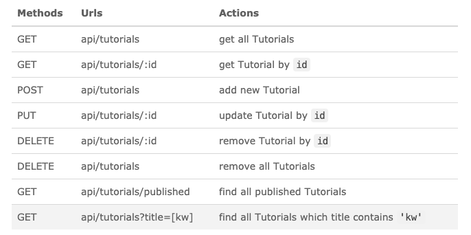
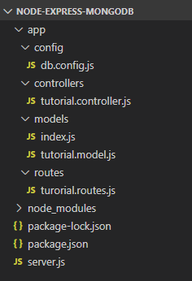

# README

## 目标

1. 合理的目录结构
2. 实现查询、添加、修改功能

## 参考

- https://bezkoder.com/node-express-mongodb-crud-rest-api/
- https://hostadvice.com/how-to/how-to-create-rest-api-with-node-express-and-mongoose/

## DEMO说明

### 功能点

### 目录结构

